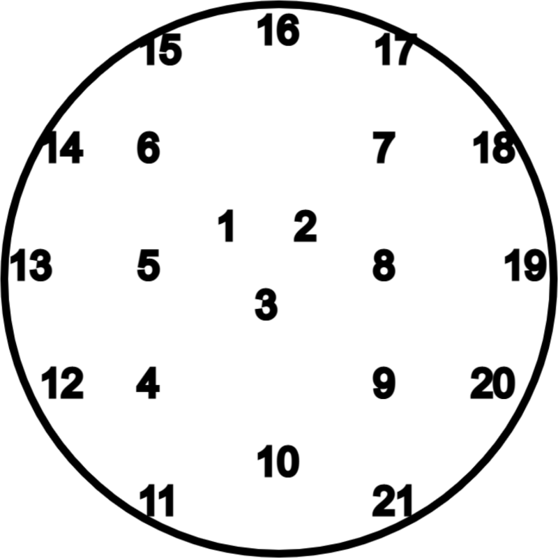

# Path of Exile timeless jewel finder

Uses the database.zip file from https://github.com/johanahlqvist/poe-timeless-jewel-multitool

Run with `dub jewels.d`.
Modify enums at the top of the script if needed.

## Jewel ids

Image from https://github.com/johanahlqvist/poe-timeless-jewel-multitool



## Example output

```
Searching 35 jewels on pathofexile.com/trade with a delay of 20 secs inbetween...
Jewel (99520, chitus) has 2 trade listing(s):
  - Name: Elegant Hubris
  - Mod: Commissioned 99520 coins to commemorate Chitus
  - Link: https://www.pathofexile.com/trade/search/Standard/jkJPdbRSX
  - Socket 1:
      - Total "increasedrarityofitemsfound": 40
  - Socket 2:
      - Total "increasedrarityofitemsfound": 0
  - Socket 5:
      - Total "increasedrarityofitemsfound": 0
  - Socket 6:
      - Total "increasedrarityofitemsfound": 0
Jewel (45640, chitus) has 1 trade listing(s):
  - Name: Elegant Hubris
  - Mod: Commissioned 45640 coins to commemorate Chitus
  - Link: https://www.pathofexile.com/trade/search/Standard/oP7ZrJwil
  - Socket 1:
      - Total "increasedrarityofitemsfound": 40
  - Socket 2:
      - Total "increasedrarityofitemsfound": 0
  - Socket 5:
      - Total "increasedrarityofitemsfound": 0
  - Socket 6:
      - Total "increasedrarityofitemsfound": 0
Jewel (42800, cadiro) has 2 trade listing(s):
  - Name: Elegant Hubris
  - Mod: Commissioned 42800 coins to commemorate Cadiro
  - Link: https://www.pathofexile.com/trade/search/Standard/2q9G0Zduk
  - Socket 1:
      - Total "increasedrarityofitemsfound": 40
  - Socket 2:
      - Total "increasedrarityofitemsfound": 0
  - Socket 5:
      - Total "increasedrarityofitemsfound": 0
  - Socket 6:
      - Total "increasedrarityofitemsfound": 0
Jewel (26940, victario) has 1 trade listing(s):
  - Name: Elegant Hubris
  - Mod: Commissioned 26940 coins to commemorate Victario
  - Link: https://www.pathofexile.com/trade/search/Standard/LK2eP22Sn
  - Socket 1:
      - Total "increasedrarityofitemsfound": 0
  - Socket 2:
      - Total "increasedrarityofitemsfound": 80
  - Socket 5:
      - Total "increasedrarityofitemsfound": 0
  - Socket 6:
      - Total "increasedrarityofitemsfound": 0
Jewel (56260, victario) has 2 trade listing(s):
  - Name: Elegant Hubris
  - Mod: Commissioned 56260 coins to commemorate Victario
  - Link: https://www.pathofexile.com/trade/search/Standard/rymYde4HQ
  - Socket 1:
      - Total "increasedrarityofitemsfound": 0
  - Socket 2:
      - Total "increasedrarityofitemsfound": 0
  - Socket 5:
      - Total "increasedrarityofitemsfound": 0
  - Socket 6:
      - Total "increasedrarityofitemsfound": 40
Jewel (140620, chitus) has 1 trade listing(s):
  - Name: Elegant Hubris
  - Mod: Commissioned 140620 coins to commemorate Chitus
  - Link: https://www.pathofexile.com/trade/search/Standard/6EpGBJdtG
  - Socket 1:
      - Total "increasedrarityofitemsfound": 80
  - Socket 2:
      - Total "increasedrarityofitemsfound": 0
  - Socket 5:
      - Total "increasedrarityofitemsfound": 0
  - Socket 6:
      - Total "increasedrarityofitemsfound": 0
...
```
